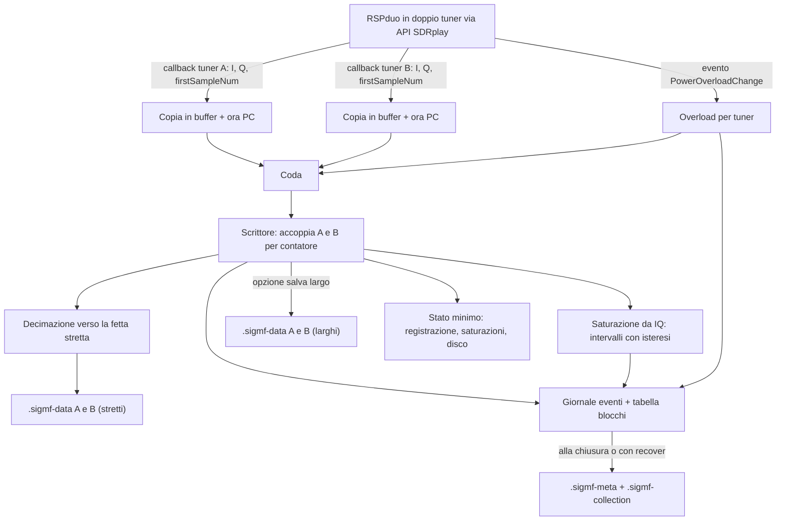
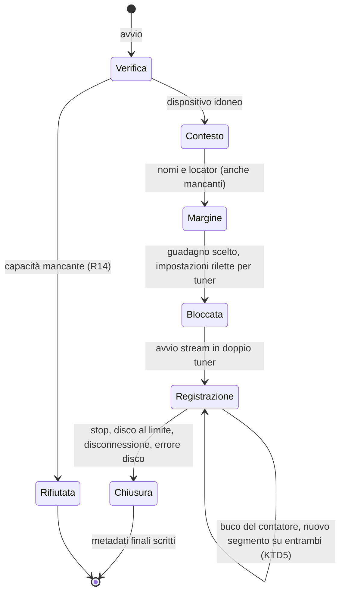

# Registratore IQ a doppio ricevitore - Plan

## Goal Capsule

- **Objective:** al CQ WW DX CW del 2026-11-28 un OM registra un'ora di dati IQ da due antenne che si possono rianalizzare offline in modo affidabile, senza dover regolare nulla sul ricevitore.
- **Means:** un registratore reAPET in Python che pilota un RSPduo in doppio tuner tramite l'API SDRplay ufficiale, collegato a un portatile Windows o macOS (KTD1, KTD14).
- **Product authority:** `STRATEGY.md` (track "Motore di misura con validazione") e il Product Contract qui sotto. L'analisi (decoder, ΔS, ΔN, rilevamento dei gradini di livello) non è in scope attivo.
- **Execution profile:** si parte da U1. La prova d'installazione con l'hardware reale decide su quale portatile proseguire. Le unità successive si possono sviluppare con il dispositivo simulato, mentre le verifiche finali richiedono l'RSPduo.
- **Stop conditions:** fermarsi e chiedere se U1 fallisce sia su Windows sia su macOS (vedi Risks), se in doppio tuner il contatore dei campioni dei due tuner non permette di allinearli, oppure se un requisito richiede di cambiare il comportamento di prodotto.
- **Open blockers:** nessuno.

---

## Product Contract

**Product Contract preservation:** changed: R1, R4, R9, R12, AE3 — ridefiniti dopo la ricerca. Acquisizione larga con salvataggio stretto, perché la saturazione si veda su tutta la banda. Overload del dispositivo dove disponibile. Portatile Windows o macOS sul campo invece di Linux più Windows. R1 non lega più l'accesso a SoapySDR: l'RSPduo usa l'API SDRplay diretta, perché il driver SoapySDRPlay3 non controlla il tuner B, non permette di allineare i canali e scarta l'overload. Le modifiche ai requisiti sono state confermate dall'utente. AE3 è stato allineato alla chiusura della sessione in caso di disconnessione (vedi Scope Boundaries).

### Summary

Un registratore che verifica che l'SDR collegato offra due ricevitori coerenti, poi imposta e blocca guadagni uguali su entrambi, con AGC spento. Acquisisce tutta la banda radioamatoriale per controllare la saturazione e, di default, salva solo una fetta stretta attorno alla sottobanda FT8. Registra con marche temporali per blocco, marca saturazioni e interruzioni e salva dati e contesto come un'unica sessione. All'avvio chiede solo il nome delle due antenne e il locator.

### Problem Frame

Ogni analisi di reAPET ha bisogno di registrazioni affidabili, e oggi non ne esistono. Le sessioni del 2019 e del 2025 hanno tre difetti, documentati in `docs/review-2019.md`:
- a metà sessione una catena è scesa di 12 dB senza che nessuno se ne accorgesse;
- manca il contesto: nessuno ricorda cosa fosse collegato;
- la posizione della finestra del rumore dipendeva da un orologio mai verificato.

Inoltre è stato salvato solo l'output del decoder. Ogni scelta sbagliata di stimatore è quindi irreversibile, perché i dati grezzi non ci sono più per rifare l'analisi.

Il CQ WW del 2026-11-28 è un raduno all'aperto con amici che portano antenne: serve a mostrare lo strumento e a formare altri OM, non a raccogliere grandi quantità di dati. Le stazioni del contest in trasmissione nelle vicinanze satureranno probabilmente i ricevitori, e sarà possibile al massimo un'ora di registrazione di prova (loop magnetico contro un'antenna reale). Sul prato non c'è alimentazione seria né rete cablata: l'hardware deve vivere su un portatile.

### Key Decisions

- **Registrazione prima dell'analisi.** L'IQ grezzo permette di rifare l'analisi sugli stessi dati cambiando decoder o stimatore, e solo la registrazione è vincolata alla data del 2026-11-28. (session-settled: user-approved — chosen over analisi per prima o decodifica in tempo reale: senza dati grezzi una sessione non è rianalizzabile.) Governs R1, R13.
- **IQ con marche temporali, non audio.** (session-settled: user-directed — chosen over registrazione audio: richiesta esplicita di IQ e marche temporali.) Governs R1, R5.
- **SDR con due ricevitori sullo stesso clock.** Elimina lo sfasamento tra due interfacce indipendenti, che in 48 h a 50 ppm arriva a circa 8 s. (session-settled: user-directed — chosen over due QMX, due SDR separati o hardware misto.) Governs R1.
- **Un'interfaccia dispositivo di reAPET con più backend; SoapySDR resta la strada per gli apparati diversi dall'RSPduo.** L'interfaccia è universale, le capacità no: per questo serve il controllo all'avvio. (session-settled: user-directed — chosen over il supporto di un singolo apparato o protocollo, come openHPSDR.) Governs R1, R14.
- **RSPduo tramite l'API SDRplay diretta, per il momento.** Il driver SoapySDRPlay3 (commit 2026-09-04) in doppio tuner ignora l'indice del canale per guadagno, AGC e frequenza (`Settings.cpp:2179`), non riallinea i canali al riavvio, scarta `firstSampleNum` e l'evento di overload (`Streaming.cpp:173`). L'API diretta li offre tutti e si installa con l'installer ufficiale per Windows e macOS. (session-settled: user-directed — chosen over correggere una copia di SoapySDRPlay3: fork C++ da mantenere e compilare.) Governs R1, R2, R9, R12.
- **Sul campo l'RSPduo alimentato dal portatile.** Orion MkII e TRX DUO richiedono alimentazione seria e cavo ethernet, quindi restano per l'uso in stazione e non sono provati in questo piano. L'RSPdx è escluso perché ha un solo tuner. (session-settled: user-directed — chosen over Orion MkII e TRX DUO sul campo: impraticabili su un prato.) Governs R12, R14.
- **Registratore reAPET che pilota l'SDR.** Guadagno e AGC non sono lasciati all'operatore, coerentemente con il confine "nessuna procedura a carico dell'operatore" di `STRATEGY.md`. (session-settled: user-approved — chosen over programma SDR esistente più diario reAPET: avrebbe lasciato guadagno e AGC all'operatore.) Governs R2, R3, R9.
- **Acquisizione larga, salvataggio stretto di default.** Si acquisisce tutta la banda così la saturazione si vede, e si salva solo la fetta utile, così la sessione resta archiviabile. Il salvataggio largo resta un'opzione. (session-settled: user-approved — chosen over acquisire e salvare largo, 58 GB/h, o acquisire stretto, che non vede la saturazione da segnali fuori fetta.) Governs R4, R9.
- **Due nomi e locator all'avvio.** (session-settled: user-approved — chosen over profilo salvato o annotazione a posteriori: un profilo invecchia senza che nessuno se ne accorga, e a distanza di tempo nessuno ricorda le antenne.) Governs R7.
- **Portatile Windows o macOS sul campo, senza WSL.** Si usa quello su cui il registratore funziona. (session-settled: user-directed — chosen over WSL con usbipd: inoltro USB fragile a questa velocità di trasferimento.) Governs R12.
- **Il guadagno lo propone reAPET, poi resta bloccato.** L'operatore non regola nulla. Governs R3.
- **La saturazione è un risultato accettabile purché dichiarata.** "Dati completi" significa senza buchi non dichiarati, non senza saturazione. Governs R9, R10.
- **L'orologio viene registrato, non preteso.** Sul campo può mancare internet. La posizione reale della pausa FT8 si ricostruisce in analisi dai DT (`docs/review-2019.md`, punto 2). Governs R6.

### Requirements

**Acquisizione**

- R1. reAPET registra contemporaneamente l'IQ di due ricevitori dello stesso SDR, sullo stesso clock di campionamento, con i due canali allineati campione per campione.
- R2. Durante una sessione i due ricevitori hanno guadagno uguale, AGC spento e impostazioni bloccate, e nessuna regolazione è possibile fino alla chiusura della sessione.
- R3. Prima di registrare, reAPET esegue un breve controllo del margine e propone il guadagno da usare. All'operatore non viene chiesta nessuna regolazione.
- R4. reAPET acquisisce la banda larga offerta dal dispositivo e di default salva solo la sottobanda FT8 della banda scelta più una porzione quieta adiacente; come opzione salva anche la banda larga.

**Tempo e contesto**

- R5. Ogni blocco di campioni registrato porta la propria marca temporale.
- R6. La sessione registra lo stato dell'orologio di sistema (sincronizzato o meno, e lo scarto se noto). La registrazione parte anche con l'orologio non sincronizzato.
- R7. All'avvio reAPET chiede il nome dell'antenna su ciascun ricevitore e il locator. Se un dato manca la registrazione parte comunque, e il dato è marcato come mancante.
- R8. Contesto e dati formano un'unica sessione, che contiene almeno: banda, frequenza centrale, frequenza di campionamento, guadagni, corrispondenza ricevitore–antenna, dispositivo e driver, locator, versione di reAPET, inizio e fine.

**Integrità**

- R9. Durante la registrazione reAPET rileva la saturazione di ciascun ricevitore sull'intera banda acquisita e, se il dispositivo lo fornisce, dal suo segnale di overload; la registra come intervalli temporali e dichiara quale dei due metodi era disponibile.
- R10. Ogni interruzione (campioni persi, disconnessione, disco pieno, arresto) è registrata nella sessione: nessun buco nei dati resta non dichiarato.

**Uso**

- R11. Durante la registrazione si vede uno stato minimo: se sta registrando, quanta saturazione c'è stata, lo spazio rimasto sul disco.
- R12. Il registratore funziona su Windows e macOS, oltre che su Linux; per il CQ WW basta che funzioni su uno dei due portatili da campo.

**Rianalisi**

- R13. Una sessione si apre offline su un'altra macchina e contiene tutto ciò che serve all'analisi: decodifica FT8, ΔS, ΔN dentro o fuori la sottobanda e, per la fase 2, la stima dell'angolo di arrivo (marche temporali, frequenze, locator).

**Compatibilità hardware**

- R14. All'avvio reAPET verifica che il dispositivo collegato offra due ricevitori sullo stesso clock, ricevuti simultaneamente, con AGC disattivabile e guadagno manuale. Se una di queste capacità manca, lo dichiara e non registra.

### Key Flows

- F1. Sessione di registrazione
  - **Trigger:** l'operatore avvia una registrazione con l'SDR collegato alle due antenne.
  - **Steps:** reAPET verifica il dispositivo (R14); l'operatore inserisce i due nomi e il locator (R7); reAPET controlla il margine e propone il guadagno (R3); le impostazioni vengono bloccate (R2); parte la registrazione con lo stato visibile (R11); saturazioni e interruzioni vengono marcate mentre accadono (R9, R10); l'operatore ferma la registrazione.
  - **Outcome:** una sessione chiusa, dati più contesto, rianalizzabile offline (R8, R13).
  - **Covered by:** R2, R3, R7, R8, R9, R10, R11, R13, R14

### Acceptance Examples

- AE1. **Covers R9.** **Given** una registrazione in corso durante il contest, **when** una stazione vicina sulla stessa banda trasmette e satura il ricevitore 1 per 40 s, **then** la sessione contiene quell'intervallo marcato come saturazione sul ricevitore 1, e la registrazione prosegue.
- AE2. **Covers R7.** **Given** l'avvio di una sessione, **when** l'operatore non inserisce il locator, **then** la registrazione parte e la sessione riporta il locator come mancante.
- AE3. **Covers R10.** **Given** una registrazione in corso, **when** il collegamento con l'SDR si interrompe per 5 s, **then** la sessione si chiude dichiarando l'interruzione con il suo inizio, senza buchi silenziosi.
- AE4. **Covers R6.** **Given** un PC senza internet e con l'orologio non sincronizzato, **when** si avvia la registrazione, **then** la registrazione parte e la sessione registra che l'orologio non era sincronizzato.
- AE5. **Covers R14.** **Given** un SDR con un solo ricevitore, oppure con due ricevitori senza campionamento simultaneo, **when** si avvia una sessione, **then** reAPET indica quale capacità manca e non registra.

### Success Criteria

- Al CQ WW del 2026-11-28 si ottiene una sessione di circa un'ora, completa secondo R8–R10: IQ di entrambi i ricevitori, contesto, saturazioni e interruzioni dichiarate.

### Scope Boundaries

- Decoder FT8, calcolo di ΔS e ΔN, rilevamento dei gradini di livello, report: sono nell'area di analisi, che è la prossima.
- Registrazione simultanea su più bande.
- Distribuzione del pacchetto e uso autonomo da parte di altri OM: al CQ WW reAPET lo usa l'autore, e gli altri guardano e imparano.
- Waterfall o visualizzazioni durante la registrazione oltre lo stato minimo di R11.
- Supporto a due ricevitori separati con clock indipendenti (due QMX, due SDR).
- Considerato e non costruito: rifiutare l'avvio in base a una stima della dimensione della sessione. La durata non è nota in anticipo, quindi la stima sarebbe arbitraria; lo spazio rimasto a schermo e la chiusura pulita al margine (KTD11) bastano.
- Considerato e non costruito: ritentare automaticamente la connessione dopo una disconnessione. La sessione si chiude con l'interruzione dichiarata e l'operatore ne avvia un'altra; al CQ WW c'è sempre qualcuno davanti al portatile. Lo si riconsidera per registrazioni lunghe senza presidio.

#### Deferred to Follow-Up Work

- Esportazione in WAV a 12 kHz per slot FT8, per decodificare con strumenti esistenti.
- Backend SoapySDR dietro la stessa interfaccia dispositivo, con prove su Orion MkII e TRX DUO tramite un driver per openHPSDR.

<!-- ce-section: work-relationships -->
### How This Work Fits Together

Questo piano copre la registrazione, prima area del motore di misura. La suddivisione che segue è la comprensione attuale, non una roadmap impegnata.

- Analisi (decoder, ΔS per spot, ΔN nella pausa FT8 posizionata dai DT e invalidata quando contaminata, rilevamento dei gradini di livello): Depends on questa registrazione (R13).
  - Validazione del metodo (test di zero con splitter, coerenza tra cicli pari e dispari): Depends on l'analisi; Shares le sessioni registrate.
- Report leggibile: Depends on l'analisi.
- Angolo di arrivo (fase 2): Depends on i dati conservati secondo R13.

### Dependencies / Assumptions

- L'API SDRplay v3 deve essere installata con l'installer ufficiale (Windows, macOS ARM e Intel, Linux), che include il servizio dell'API. reAPET la usa direttamente: non serve SoapySDR sul portatile da campo.
- La protezione fisica dell'ingresso dell'SDR dalle trasmissioni vicine (limitatore, distanza tra le antenne) è un prerequisito di installazione a carico dell'utente, non una funzione del registratore.

### Sources / Research

- `STRATEGY.md`: confini, metriche, traguardo del CQ WW.
- `docs/review-2019.md`: punto 2, il gradino di −12 dB su RX2, la posizione della finestra del rumore e la distribuzione dei DT.
- SoapySDRPlay3 (github.com/pothosware/SoapySDRPlay3, commit 48bd8b4 del 2026-09-04): `Settings.cpp:2179` (puntatore unico ai parametri del canale), `Streaming.cpp` `activateStream`/`deactivateStream` e gestione di `PowerOverloadChange`.

---

## Planning Contract

### Key Technical Decisions

- KTD1. **Python 3.12 o 3.13, pacchetto `reapet` con riga di comando.** Il notebook storico resta dov'è e non viene toccato. Tre comandi: `doctor` (installazione e capacità del dispositivo), `record`, `recover`.
- KTD2. **Sessione in formato SigMF: una Collection con una registrazione per antenna.** La specifica raccomanda le Collection per l'IQ multicanale, e l'estensione `antenna` descrive un'antenna per registrazione. Gli array `captures` sono identici nelle due registrazioni, con un nuovo segmento solo all'avvio e dopo ogni buco (`core:datetime`, `core:global_index`). Saturazioni, overload e interruzioni sono annotazioni. Il contesto reAPET (locator, stato dell'orologio, impostazioni rilette per tuner, versione dell'API, metodo di rilevamento della saturazione) va nel namespace `reapet:`. Il locator va anche in `core:geolocation` come centro approssimato del quadrato. Governs R5, R8, R10, R13.
- KTD3. **Formato nativo del dispositivo senza conversioni.** L'API SDRplay consegna I e Q come interi a 16 bit in array separati: vengono interlacciati e salvati come `ci16_le`, con la scala nei metadati. Governs R13.
- KTD4. **Marche temporali per blocco in una tabella a parte, non un segmento SigMF per blocco.** Per ogni blocco la tabella riporta il contatore `firstSampleNum` dell'API, l'ora del PC in ns, picco e RMS in dBFS, campioni al fondo scala e flag di stato. Governs R5, R9.
- KTD5. **Allineamento e buchi dal contatore dei campioni.** I blocchi dei due tuner si accoppiano per `firstSampleNum`. Una discontinuità del contatore su un tuner, o un blocco scartato per coda piena, è un buco di lunghezza esatta: si scartano i campioni dell'altro tuner nello stesso intervallo e si apre su entrambe le registrazioni un nuovo segmento con lo stesso `core:global_index`. Così le due registrazioni restano allineate campione per campione senza fermare lo stream. Governs R1, R10.
- KTD6. **Acquisizione a ~2 MS/s e decimazione software verso ~62,5 kS/s.** Il tuner viene centrato in modo che la fetta FT8 non cada sullo spurio in continua. La fetta stretta si posiziona in modo da contenere la sottobanda FT8 e una porzione adiacente senza sottobande di modi digitali, e la posizione per ogni banda è documentata. La fetta si estrae con conversione numerica e filtro FIR polifase, il cui stato viene mantenuto da un blocco all'altro. Il controllo della saturazione avviene sul blocco largo prima della decimazione. Con l'opzione "salva largo" si scrive anche lo stream largo. I valori esatti si fissano in U4 sulla base delle modalità del doppio tuner. Governs R4, R9.
- KTD7. **Saturazione da due fonti.** Dall'IQ si contano i campioni con |I| o |Q| ≥ 98% del fondo scala, formando intervalli con isteresi: un intervallo si apre al primo blocco saturo e si chiude dopo 1 s di blocchi puliti. Dall'API arrivano gli eventi `PowerOverloadChange` per tuner, che vanno confermati con l'apposito aggiornamento e diventano intervalli di overload. Le due fonti sono annotazioni distinte, così l'analisi distingue clipping nella banda acquisita da sovraccarico dello stadio d'ingresso. Governs R9.
- KTD8. **La callback dell'API fa solo il minimo.** Copia I e Q in un buffer preallocato, annota contatore e ora del PC e accoda; non fa calcoli. Uno scrittore separato si occupa di statistiche, saturazione, decimazione, disco e giornale; l'interfaccia sta nel thread principale. La coda deve assorbire alcuni secondi di rallentamento del disco. Se si riempie, il blocco viene scartato e conta come buco (KTD5), senza mai bloccare la callback. Governs R1, R10.
- KTD9. **Scrittura sicura in caso di crash.** I dati grezzi vanno su `.sigmf-data` a campioni interi. Gli eventi vanno in un giornale append-only (JSON Lines) con flush e fsync periodico. I metadati finali si compongono alla chiusura e si scrivono in modo atomico. `reapet recover` tronca i dati a campioni interi e ricostruisce i metadati dal giornale. Governs R10, R13.
- KTD10. **Orologio: interrogazione SNTP fatta dal programma** all'avvio, ogni 5 minuti e alla chiusura, con scarto, tempo di andata e ritorno e server. Funziona uguale su Windows e macOS senza privilegi. Lo stato del sistema operativo si aggiunge quando è leggibile; senza rete si registra "sconosciuto", mai "ok". Governs R6.
- KTD11. **Disco:** durante la registrazione lo spazio si controlla ogni pochi secondi, e la registrazione si chiude in modo pulito sotto un margine (il maggiore fra 1 GB e 2 minuti di dati). Un errore di disco pieno in scrittura chiude la sessione con l'interruzione dichiarata. Governs R10, R11.
- KTD12. **Controllo del margine e proposta del guadagno.** Si fa una breve acquisizione di prova a riduzioni di guadagno crescenti, uguali sui due tuner, e si sceglie il guadagno più alto che lascia un margine di picco prefissato su entrambi e non provoca eventi di overload. Il valore poi si blocca e si rilegge per ciascun tuner. Le soglie si tarano in U6 con l'RSPduo reale. Governs R3.
- KTD13. **Un dispositivo simulato con la stessa interfaccia del backend** è la base di tutti i test automatici: produce rumore più toni con contatore dei campioni, clipping, eventi di overload, buchi del contatore e disconnessioni a comando.
- KTD14. **Binding all'API SDRplay con `ctypes`, senza compilazione.** Si caricano la libreria dell'API installata e le strutture necessarie: selezione del dispositivo in doppio tuner, parametri per tuner A e B, callback di stream e di eventi. In doppio tuner ogni parametro si imposta sulla struttura del tuner corrispondente e si rilegge da lì. Se le callback in Python non reggono 2 MS/s per due canali, il ripiego è un piccolo modulo C che accumula blocchi e li consegna a Python; si decide in U1 sulla base della misura. Governs R1, R2, R9, R12.

### High-Level Technical Design

Flusso dei dati durante la registrazione:



Stati della sessione:



### Output Structure

```text
pyproject.toml
src/reapet/
  __init__.py
  cli.py              # comandi doctor, record, recover
  device.py           # interfaccia dispositivo e controllo delle capacità
  sdrplay.py          # backend sull'API SDRplay (ctypes)
  fake_device.py      # dispositivo simulato (KTD13)
  acquisition.py      # coda, scrittore, accoppiamento per contatore, buchi
  dsp.py              # decimazione, statistiche dei blocchi, saturazione
  session.py          # SigMF collection, giornale, chiusura, recover
  context.py          # nomi, locator, SNTP, stato dell'orologio
  gain.py             # controllo del margine
tests/
docs/install.md
```

### Assumptions

- In doppio tuner l'API SDRplay consegna nelle callback dei tuner A e B valori di `firstSampleNum` che coincidono per lo stesso istante. Si verifica in U1 con un segnale comune su entrambi gli ingressi. Se non è vero, scatta la stop condition del Goal Capsule.
- A ~2 MS/s per due canali, Python con numpy e scipy regge callback, decimazione e scrittura su un portatile recente. Si misura in U1 e si conferma nella prova di durata di U7.

### Risks

| Rischio | Effetto | Mitigazione |
|---|---|---|
| Le callback in Python non reggono 2 MS/s per due canali | Buchi frequenti, ore spezzettate | Misura in U1; ripiego sul modulo C (KTD14) oppure si scende a 1 MS/s |
| Strutture dell'API cambiate tra versioni | Il binding `ctypes` legge campi sbagliati | Si fissa la versione dell'API supportata, `doctor` la verifica e rifiuta le altre |
| Saturazione da trasmissioni su altre bande | Clipping non visibile nell'IQ | Eventi di overload dall'API (KTD7) |
| Tempo: 7 settimane alla data | Registratore incompleto al CQ WW | Ordine delle unità che porta presto a una registrazione minima end-to-end (U2 → U3 → U4) |

---

## Implementation Units

### U1. Scheletro del progetto e prova sull'hardware

- **Goal:** pacchetto Python con il comando `reapet doctor`, e la verifica, sull'hardware reale, che il binding all'API SDRplay apra l'RSPduo in doppio tuner, regga la velocità di trasferimento e dia contatori allineati.
- **Requirements:** R1, R12, R14 (parte diagnostica); KTD1, KTD14.
- **Dependencies:** nessuna.
- **Files:** `pyproject.toml`, `src/reapet/__init__.py`, `src/reapet/cli.py`, `src/reapet/sdrplay.py`, `docs/install.md`, `tests/test_cli_doctor.py`.
- **Approach:**
  1. Configurare il progetto con `src/` e le dipendenze (numpy, scipy, sigmf), più pytest e ruff.
  2. Primo nucleo del binding: caricare la libreria dell'API, leggerne la versione, elencare i dispositivi, selezionare l'RSPduo in doppio tuner, avviare lo stream e ricevere le callback.
  3. Il comando `doctor` riporta versione dell'API, dispositivi trovati, modalità disponibili, frequenze di campionamento e risultato di una breve ricezione su entrambi i tuner.
  4. Documentare in `docs/install.md` l'installazione dell'API e l'esito delle prove.
- **Execution note:** la prova vera è sull'hardware, sul primo portatile (macOS); Windows si prova solo se macOS fallisce, o se avanza tempo dopo U7. Tre misure: `firstSampleNum` di A e B coincidono con lo stesso segnale su entrambi gli ingressi tramite splitter; 10 minuti a ~2 MS/s per tuner senza buchi del contatore con callback in Python; la decisione su KTD14 (Python o modulo C) annotata in `docs/install.md`.
- **Test scenarios:**
  - `doctor` senza API installata dice che l'API manca e come installarla, ed esce senza errori.
  - `doctor` con una versione dell'API non supportata la segnala e non prosegue.
  - `doctor` senza dispositivi collegati riporta la versione dell'API e "nessun dispositivo".
- **Verification:** `doctor` gira con l'RSPduo su almeno un portatile, e `docs/install.md` riporta le tre misure.

### U2. Interfaccia dispositivo, backend SDRplay, dispositivo simulato e controllo delle capacità

- **Goal:** un'interfaccia unica per aprire il dispositivo, verificarne le capacità, impostare e bloccare i parametri per tuner, rileggerli e avviare lo stream, con il backend SDRplay e uno simulato.
- **Requirements:** R1, R2, R14; KTD3, KTD13, KTD14. Covers AE5.
- **Dependencies:** U1.
- **Files:** `src/reapet/device.py`, `src/reapet/sdrplay.py`, `src/reapet/fake_device.py`, `tests/test_device.py`.
- **Approach:**
  1. Il controllo delle capacità verifica: due ricevitori, ricezione simultanea sullo stesso clock con contatore dei campioni, AGC disattivabile, guadagno manuale.
  2. Le due catene devono essere equivalenti: sull'RSPduo si usa su entrambi i tuner lo stesso tipo di ingresso (50 Ω, non l'ingresso Hi-Z che esiste solo sul tuner 1), con le stesse impostazioni di filtri e notch.
  3. Il blocco imposta frequenza, campionamento, larghezza di banda, AGC spento e riduzioni di guadagno uguali sulle strutture del tuner A e del tuner B, poi le rilegge da ciascuna e conserva i valori riletti. Dopo il blocco ogni modifica è rifiutata (R2).
  4. Gli eventi di overload vengono confermati all'API e inoltrati alla coda come eventi per tuner.
  5. Il dispositivo simulato espone la stessa interfaccia e permette di iniettare clipping, overload, buchi del contatore e disconnessione.
- **Test scenarios:**
  - Covers AE5. Un dispositivo simulato con un solo ricevitore viene rifiutato, e il messaggio nomina la capacità mancante.
  - Covers AE5. Un dispositivo simulato con due ricevitori che non campionano simultaneamente viene rifiutato, e il messaggio nomina la ricezione simultanea.
  - Un dispositivo simulato senza guadagno manuale viene rifiutato con il motivo.
  - Un dispositivo idoneo, dopo il blocco, rilegge da ciascun tuner riduzioni di guadagno uguali e AGC spento, e i valori riletti finiscono nel contesto.
  - Se il tuner B rilegge un valore diverso dal tuner A, la differenza viene segnalata e la registrazione non parte.
  - Un tentativo di cambiare il guadagno dopo il blocco viene rifiutato.
  - Un dispositivo simulato con ingressi diversi sui due canali viene configurato con lo stesso tipo di ingresso su entrambi, e la scelta risulta nel contesto.
  - `doctor` con il dispositivo simulato elenca due ricevitori, le frequenze di campionamento e il formato nativo.
- **Verification:** i test passano con il dispositivo simulato. Con l'RSPduo, lo stesso segnale su entrambi i tuner tramite splitter, al variare della riduzione di guadagno, dà livelli di B che seguono A entro una tolleranza annotata, con AGC spento su entrambi.

### U3. Sessione SigMF, giornale e recupero

- **Goal:** scrivere una sessione come Collection SigMF di due registrazioni, in modo che resista a un crash, e ricostruirla con `reapet recover`.
- **Requirements:** R5, R8, R10, R13; KTD2, KTD3, KTD4, KTD9.
- **Dependencies:** U2.
- **Files:** `src/reapet/session.py`, `src/reapet/cli.py`, `tests/test_session.py`.
- **Approach:**
  1. All'apertura si creano la cartella della sessione, i due file `.sigmf-data` e il giornale, e si scrivono metadati provvisori.
  2. Durante la registrazione si accodano campioni interi ai dati, mentre segmenti, annotazioni ed eventi vanno nel giornale; la tabella dei blocchi è un file a parte.
  3. Alla chiusura i metadati di ciascuna registrazione e la Collection si compongono dal giornale e si scrivono in modo atomico.
  4. `recover` tronca i dati a campioni interi, ricostruisce i metadati dal giornale e annota la chiusura anomala.
- **Test scenarios:**
  - Una sessione chiusa normalmente si rilegge con la libreria `sigmf`, le due registrazioni sono valide, hanno lo stesso numero di campioni e gli stessi segmenti.
  - Le annotazioni risultano ordinate per campione iniziale e portano le chiavi `reapet:`.
  - Un file dati troncato a metà campione, dopo `recover`, è valido e contiene un'annotazione di chiusura anomala.
  - Un buco registrato nel giornale produce su entrambe le registrazioni un nuovo segmento con lo stesso `core:global_index`.
  - Il locator mancante viene salvato come mancante e non come stringa vuota.
- **Verification:** una sessione simulata di qualche minuto si apre in un lettore SigMF esterno (per esempio IQEngine o inspectrum) e si ricostruisce dopo un'interruzione forzata del processo.

### U4. Acquisizione, decimazione e saturazione

- **Goal:** la pipeline che riceve i due tuner, li accoppia per contatore, controlla la saturazione sulla banda larga, decima verso la fetta stretta e gestisce buchi e disconnessioni.
- **Requirements:** R1, R4, R5, R9, R10; KTD4, KTD5, KTD6, KTD7, KTD8. Covers AE1, AE3.
- **Dependencies:** U2, U3.
- **Files:** `src/reapet/acquisition.py`, `src/reapet/dsp.py`, `tests/test_dsp.py`, `tests/test_acquisition.py`.
- **Approach:**
  1. Le callback accodano blocchi a buffer riciclati con contatore e ora del PC (KTD8).
  2. Lo scrittore accoppia i blocchi di A e B per contatore, applica KTD5 ai buchi, aggiorna gli intervalli di saturazione e di overload per tuner, decima verso la fetta stretta e passa dati ed eventi a `session.py`.
  3. L'assenza di callback per almeno 3 s, oppure un evento di dispositivo rimosso dall'API, vale come disconnessione: la sessione si chiude con l'interruzione dichiarata.
- **Test scenarios:**
  - Covers AE1. 40 s di clipping iniettato sul tuner A producono un'annotazione di saturazione su A di circa 40 s e nessuna su B.
  - Un evento di overload su B seguito da quello di fine produce un'annotazione di overload su B con inizio e fine.
  - Due burst di clipping separati da meno di 1 s formano un solo intervallo; separati da più di 1 s, due.
  - La decimazione di un tono a +1,5 kHz dalla frequenza FT8 lo restituisce alla frequenza attesa nella fetta stretta. Un tono fuori fetta viene attenuato almeno quanto previsto dal filtro.
  - La decimazione su blocchi consecutivi dà lo stesso risultato della decimazione dell'intero segnale in un colpo solo, senza discontinuità ai bordi.
  - Un buco del contatore sul solo tuner B produce su entrambe le registrazioni lo stesso nuovo segmento, e le due registrazioni hanno lo stesso numero di campioni.
  - Blocchi di A e B che arrivano in ordine diverso vengono comunque accoppiati per contatore.
  - Covers AE3. Una disconnessione simulata di 5 s chiude la sessione con un'annotazione di interruzione che ne riporta l'inizio.
  - Uno scrittore rallentato artificialmente che riempie la coda produce un blocco scartato trattato come buco (KTD5), senza bloccare la callback.
- **Verification:** i test passano; con l'RSPduo, 10 minuti a ~2 MS/s per tuner con il numero di buchi annotato. Un segnale forte nella stessa banda, iniettato tramite attenuatore su un tuner, apre un intervallo di saturazione o di overload; la soglia di KTD7 si tara sul picco misurato all'inizio del sovraccarico.

### U5. Contesto: antenne, locator e orologio

- **Goal:** raccogliere all'avvio nomi delle antenne e locator, misurare lo stato dell'orologio durante la sessione e comporre il contesto completo.
- **Requirements:** R6, R7, R8; KTD10. Covers AE2, AE4.
- **Dependencies:** U3.
- **Files:** `src/reapet/context.py`, `tests/test_context.py`.
- **Approach:**
  1. Le domande all'avvio accettano risposte vuote, che vengono marcate come mancanti. Il locator viene validato (4 o 6 caratteri Maidenhead) e convertito nel centro del quadrato.
  2. Il client SNTP minimo interroga all'avvio, ogni 5 minuti e alla chiusura; lo stato del sistema operativo si legge senza privilegi dove possibile.
  3. Il contesto raccoglie i valori riletti dal dispositivo, le versioni di driver e moduli, la versione di reAPET, il metodo di rilevamento della saturazione e l'ora di inizio e di fine.
- **Test scenarios:**
  - Covers AE2. Un locator vuoto produce una sessione con locator "mancante" e nessuna geolocalizzazione.
  - Un locator non valido (`JN6`) viene segnalato e richiesto di nuovo; se si conferma vuoto risulta mancante.
  - `JN65` e `JN65ag` producono centri del quadrato corretti entro la precisione del quadrato.
  - Covers AE4. Senza rete, lo stato dell'orologio risulta "sconosciuto" e la registrazione parte.
  - Una risposta SNTP simulata con scarto +350 ms viene salvata con scarto, tempo di andata e ritorno e server.
- **Verification:** i test passano; su un portatile reale lo stato dell'orologio si legge senza privilegi di amministratore.

### U6. Controllo del margine e proposta del guadagno

- **Goal:** scegliere il guadagno prima della registrazione senza intervento dell'operatore.
- **Requirements:** R3; KTD12.
- **Dependencies:** U2, U4.
- **Files:** `src/reapet/gain.py`, `tests/test_gain.py`.
- **Approach:**
  1. Brevi acquisizioni a riduzioni di guadagno crescenti, uguali sui due tuner, misurando il picco sulla banda larga e gli eventi di overload.
  2. Si sceglie il guadagno più alto che lascia il margine prefissato su entrambi i canali; si mostra il valore proposto e lo si applica con il blocco di U2.
- **Test scenarios:**
  - Con un dispositivo simulato il cui picco supera il margine sopra un certo guadagno, viene scelto il gradino immediatamente inferiore.
  - Se un solo canale è più forte, il guadagno scelto rispetta il margine su quel canale e viene applicato uguale a entrambi.
  - Se nemmeno il guadagno minimo rispetta il margine, si usa il minimo e la sessione registra che il margine non era rispettato.
- **Verification:** i test passano; con l'RSPduo le soglie vengono tarate e i valori scelti annotati in `docs/install.md`.

### U7. Comando `record`, stato minimo e prova di durata

- **Goal:** il comando che esegue l'intero flusso F1, con lo stato minimo a schermo e i controlli sul disco.
- **Requirements:** R10, R11, F1; KTD11.
- **Dependencies:** U3, U4, U5, U6.
- **Files:** `src/reapet/cli.py`, `tests/test_record_e2e.py`, `docs/install.md`.
- **Approach:**
  1. `record` esegue verifica, domande, controllo del margine, blocco, registrazione e chiusura; Ctrl-C chiude in modo pulito.
  2. Lo stato si aggiorna circa una volta al secondo: tempo registrato, intervalli di saturazione e di overload per tuner, buchi, spazio su disco rimasto.
  3. I controlli sul disco seguono KTD11.
  4. In `docs/install.md` si aggiunge una lista di controllo per il campo: alimentazione, cavi, protezione dell'ingresso, comandi.
- **Test scenarios:**
  - Covers F1. Una registrazione end-to-end di 30 s con il dispositivo simulato produce una sessione valida e uno stato che riporta tempo e saturazioni.
  - Con lo spazio che scende sotto il margine durante la registrazione, la sessione si chiude in modo pulito con un'annotazione "disco al limite".
  - Un errore di disco pieno in scrittura chiude la sessione con l'interruzione dichiarata, e `recover` non è necessario.
  - Ctrl-C produce una sessione chiusa e valida.
- **Verification:** prova di durata di un'ora con l'RSPduo sul portatile scelto, con due antenne o uno splitter; la sessione è valida, le interruzioni (se ce ne sono) sono dichiarate, ed è annotato il numero di buchi.

---

## Verification Contract

| Verifica | Come | Quando |
|---|---|---|
| Test automatici | `pytest` | dopo ogni unità |
| Lint | `ruff check` | dopo ogni unità |
| Installazione e capacità | `reapet doctor` con l'RSPduo sul primo portatile che passa (macOS, poi Windows se serve) | U1, U2 |
| Allineamento | stesso segnale su entrambi i tuner tramite splitter; `firstSampleNum` coincidenti e livelli di B che seguono A | U1, U2 |
| Validità SigMF | rilettura con la libreria `sigmf` e apertura in un lettore esterno | U3, U7 |
| Recupero | interruzione forzata del processo a metà registrazione, poi `reapet recover` | U3, U7 |
| Saturazione e overload | segnale forte nella stessa banda su un tuner tramite attenuatore | U4 |
| Durata | un'ora di registrazione reale a ~2 MS/s per canale | U7 |

---

## Definition of Done

- Tutte le unità sono implementate e i loro test passano; `ruff check` è pulito.
- `reapet doctor` riporta "idoneo" con l'RSPduo su almeno un portatile, e `docs/install.md` descrive come arrivarci.
- La prova di durata di un'ora produce una sessione SigMF valida, con contesto completo (R8), saturazioni e interruzioni dichiarate (R9, R10) e il metodo di rilevamento della saturazione indicato.
- Una sessione interrotta forzatamente si ricostruisce con `reapet recover`.
- Nessun codice di tentativi abbandonati resta nel diff; il notebook e i file storici nella radice del repo non sono modificati.
