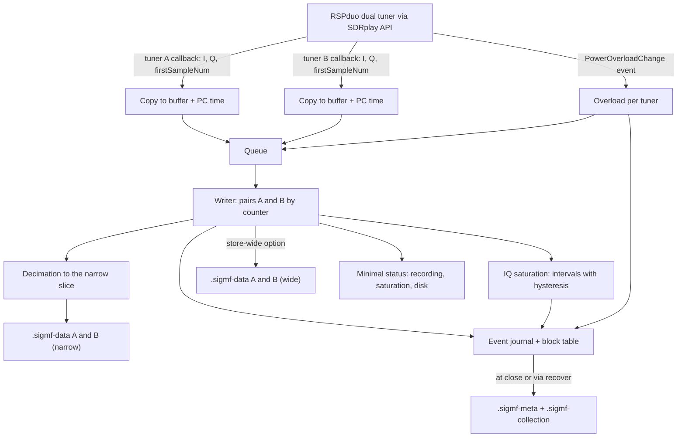
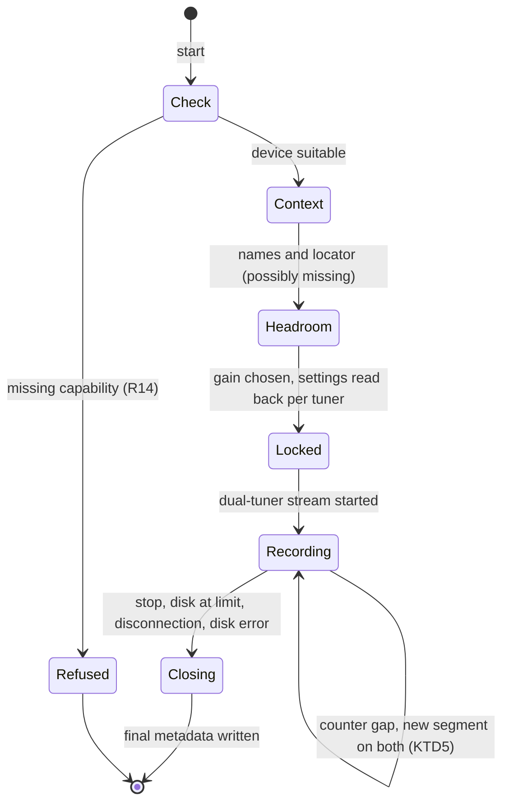

# Dual-receiver IQ recorder - Plan

## Goal Capsule

- **Objective:** at the CQ WW DX CW contest on 2026-11-28, a ham records one hour of IQ data from two antennas that can be reliably reanalysed offline, without adjusting anything on the receiver.
- **Means:** a reAPET recorder in Python that drives an RSPduo in dual-tuner mode through the official SDRplay API, connected to a Windows or macOS laptop (KTD1, KTD14).
- **Product authority:** `STRATEGY.md` (track "Measurement engine with validation") and the Product Contract below. Analysis (decoder, ΔS, ΔN, level-step detection) is not in active scope.
- **Execution profile:** start with U1. The installation test on real hardware decides which laptop to continue on. Later units can be developed against the simulated device; the final checks need the RSPduo.
- **Stop conditions:** stop and ask if U1 fails on both Windows and macOS (see Risks), if in dual-tuner mode the two tuners' sample counters do not allow them to be aligned, or if a requirement needs a change in product behaviour.
- **Open blockers:** none.

---

## Product Contract

**Product Contract preservation:** changed: R1, R4, R9, R12, AE3 — redefined after research. Wide capture with narrow storage, so that saturation is visible across the whole band. Device overload where available. A Windows or macOS laptop in the field instead of Linux plus Windows. R1 no longer ties access to SoapySDR: the RSPduo uses the SDRplay API directly, because the SoapySDRPlay3 driver does not control tuner B, cannot align the channels and drops overload. The requirement changes were confirmed by the user. AE3 was aligned with closing the session on disconnection (see Scope Boundaries).

### Summary

A recorder that checks that the connected SDR offers two coherent receivers, then sets and locks equal gains on both, with AGC off. It captures the whole amateur band to watch for saturation and, by default, stores only a narrow slice around the FT8 subband. It records with per-block timestamps, marks saturation and interruptions, and stores data and context as one session. At start it asks only for the names of the two antennas and the locator.

### Problem Frame

Every reAPET analysis needs reliable recordings, and none exist today. The 2019 and 2025 sessions have three defects, documented in `docs/review-2019.md`:
- mid-session one chain dropped by 12 dB without anyone noticing;
- context is missing: nobody remembers what was connected;
- the position of the noise window depended on a clock that was never checked.

Moreover, only the decoder output was saved. Every wrong choice of estimator is therefore irreversible, because the raw data is no longer there to redo the analysis.

The CQ WW on 2026-11-28 is an outdoor gathering with friends who bring antennas: it is meant to show the tool and train other hams, not to collect large amounts of data. Contest stations transmitting nearby will probably saturate the receivers, and at most one hour of test recording will be possible (magnetic loop against a real antenna). On the field there is no serious power supply and no wired network: the hardware has to live on a laptop.

### Key Decisions

- **Recording before analysis.** Raw IQ allows the analysis to be redone on the same data with a different decoder or estimator, and only the recording is bound to the 2026-11-28 date. (session-settled: user-approved — chosen over analysis first or real-time decoding: without raw data a session cannot be reanalysed.) Governs R1, R13.
- **IQ with timestamps, not audio.** (session-settled: user-directed — chosen over audio recording: explicit request for IQ and timestamps.) Governs R1, R5.
- **An SDR with two receivers on the same clock.** Removes the drift between two independent interfaces, which at 50 ppm reaches about 8 s in 48 h. (session-settled: user-directed — chosen over two QMX, two separate SDRs or mixed hardware.) Governs R1.
- **A reAPET device interface with several backends; SoapySDR remains the path for devices other than the RSPduo.** The interface is universal, the capabilities are not: hence the start-up check. (session-settled: user-directed — chosen over supporting a single device or protocol, such as openHPSDR.) Governs R1, R14.
- **RSPduo through the SDRplay API directly, for now.** In dual-tuner mode the SoapySDRPlay3 driver (commit of 2026-09-04) ignores the channel index for gain, AGC and frequency (`Settings.cpp:2179`), does not realign the channels on restart, and drops `firstSampleNum` and the overload event (`Streaming.cpp:173`). The direct API provides all of them and installs with the official installer for Windows and macOS. See `docs/solutions/tooling-decisions/rspduo-dual-tuner-sdrplay-api-not-soapysdrplay3.md`. (session-settled: user-directed — chosen over patching a copy of SoapySDRPlay3: a C++ fork to maintain and build.) Governs R1, R2, R9, R12.
- **In the field, the RSPduo powered by the laptop.** Orion MkII and TRX DUO need a serious power supply and an ethernet cable, so they stay for station use and are not tested in this plan. The RSPdx is excluded because it has a single tuner. (session-settled: user-directed — chosen over Orion MkII and TRX DUO in the field: impractical on a lawn.) Governs R12, R14.
- **A reAPET recorder that drives the SDR.** Gain and AGC are not left to the operator, consistent with the "no procedures on the operator" boundary in `STRATEGY.md`. (session-settled: user-approved — chosen over an existing SDR program plus a reAPET log: it would have left gain and AGC to the operator.) Governs R2, R3, R9.
- **Wide capture, narrow storage by default.** The whole band is captured so saturation is visible, and only the useful slice is stored, so the session stays archivable. Wide storage remains an option. (session-settled: user-approved — chosen over capturing and storing wide, 58 GB/h, or capturing narrow, which misses saturation from signals outside the slice.) Governs R4, R9.
- **Two names and the locator at start.** (session-settled: user-approved — chosen over a saved profile or annotation afterwards: a profile goes stale without anyone noticing, and after a while nobody remembers the antennas.) Governs R7.
- **A Windows or macOS laptop in the field, without WSL.** Whichever the recorder works on is used. (session-settled: user-directed — chosen over WSL with usbipd: USB forwarding is fragile at this data rate.) Governs R12.
- **reAPET proposes the gain, then locks it.** The operator adjusts nothing. Governs R3.
- **Saturation is an acceptable outcome as long as it is declared.** "Complete data" means no undeclared gaps, not no saturation. Governs R9, R10.
- **The clock is recorded, not required.** The field may have no internet. The real position of the FT8 pause is reconstructed in analysis from the DTs (`docs/review-2019.md`, item 2). Governs R6.

### Requirements

**Capture**

- R1. reAPET records the IQ of two receivers of the same SDR at the same time, on the same sample clock, with the two channels aligned sample by sample.
- R2. During a session the two receivers have equal gain, AGC off and locked settings, and no adjustment is possible until the session closes.
- R3. Before recording, reAPET runs a short headroom check and proposes the gain to use. The operator is not asked to adjust anything.
- R4. reAPET captures the wide band the device offers and by default stores only the FT8 subband of the chosen band plus an adjacent quiet slice; as an option it also stores the wide band.

**Time and context**

- R5. Every recorded block of samples carries its own timestamp.
- R6. The session records the state of the system clock (synchronised or not, and the offset if known). Recording starts even with an unsynchronised clock.
- R7. At start reAPET asks for the name of the antenna on each receiver and for the locator. If an item is missing, recording starts anyway and the item is marked as missing.
- R8. Context and data form one session, which contains at least: band, centre frequency, sample rate, gains, receiver-to-antenna mapping, device and driver, locator, reAPET version, start and end.

**Integrity**

- R9. During recording reAPET detects the saturation of each receiver across the whole captured band and, if the device provides it, from its overload signal; it records it as time intervals and declares which of the two methods was available.
- R10. Every interruption (lost samples, disconnection, full disk, stop) is recorded in the session: no gap in the data stays undeclared.

**Use**

- R11. During recording a minimal status is visible: whether it is recording, how much saturation has occurred, the disk space left.
- R12. The recorder runs on Windows and macOS, as well as on Linux; for the CQ WW it is enough that it runs on one of the two field laptops.

**Reanalysis**

- R13. A session opens offline on another machine and contains everything the analysis needs: FT8 decoding, ΔS, ΔN inside or outside the subband and, for phase 2, the angle-of-arrival estimate (timestamps, frequencies, locator).

**Hardware compatibility**

- R14. At start reAPET checks that the connected device offers two receivers on the same clock, received simultaneously, with AGC that can be disabled and manual gain. If any of these capabilities is missing, it says so and does not record.

### Key Flows

- F1. Recording session
  - **Trigger:** the operator starts a recording with the SDR connected to the two antennas.
  - **Steps:** reAPET checks the device (R14); the operator enters the two names and the locator (R7); reAPET checks the headroom and proposes the gain (R3); the settings are locked (R2); recording starts with the status visible (R11); saturation and interruptions are marked as they happen (R9, R10); the operator stops the recording.
  - **Outcome:** a closed session, data plus context, reanalysable offline (R8, R13).
  - **Covered by:** R2, R3, R7, R8, R9, R10, R11, R13, R14

### Acceptance Examples

- AE1. **Covers R9.** **Given** a recording in progress during the contest, **when** a nearby station on the same band transmits and saturates receiver 1 for 40 s, **then** the session contains that interval marked as saturation on receiver 1, and recording continues.
- AE2. **Covers R7.** **Given** the start of a session, **when** the operator does not enter the locator, **then** recording starts and the session reports the locator as missing.
- AE3. **Covers R10.** **Given** a recording in progress, **when** the link to the SDR drops for 5 s, **then** the session closes declaring the interruption with its start, with no silent gaps.
- AE4. **Covers R6.** **Given** a PC without internet and with an unsynchronised clock, **when** recording starts, **then** recording proceeds and the session records that the clock was not synchronised.
- AE5. **Covers R14.** **Given** an SDR with a single receiver, or with two receivers that do not sample simultaneously, **when** a session starts, **then** reAPET states which capability is missing and does not record.

### Success Criteria

- At the CQ WW on 2026-11-28 a session of about one hour is obtained, complete according to R8–R10: IQ from both receivers, context, saturation and interruptions declared.

### Scope Boundaries

- FT8 decoder, ΔS and ΔN computation, level-step detection, report: these belong to the analysis area, which comes next.
- Simultaneous recording on several bands.
- Distribution of the package and autonomous use by other hams: at the CQ WW the author runs reAPET, and the others watch and learn.
- Waterfall or visualisations during recording beyond the minimal status of R11.
- Support for two separate receivers with independent clocks (two QMX, two SDRs).
- Considered and not built: refusing to start based on an estimate of the session size. The duration is not known in advance, so the estimate would be arbitrary; the remaining space on screen and the clean close at the margin (KTD11) are enough.
- Considered and not built: retrying the connection automatically after a disconnection. The session closes with the interruption declared and the operator starts another one; at the CQ WW someone is always at the laptop. To be reconsidered for long unattended recordings.

#### Deferred to Follow-Up Work

- Export to 12 kHz WAV per FT8 slot, for decoding with existing tools.
- A SoapySDR backend behind the same device interface, tested on Orion MkII and TRX DUO through an openHPSDR driver.

<!-- ce-section: work-relationships -->
### How This Work Fits Together

This plan covers recording, the first area of the measurement engine. The breakdown below is the current understanding, not a committed roadmap.

- Analysis (decoder, ΔS per spot, ΔN in the FT8 pause placed from the DTs and invalidated when contaminated, level-step detection): Depends on this recording (R13).
  - Method validation (zero test with a splitter, consistency between even and odd cycles): Depends on the analysis; Shares the recorded sessions.
- Readable report: Depends on the analysis.
- Angle of arrival (phase 2): Depends on the data kept according to R13.

### Dependencies / Assumptions

- The SDRplay API v3 must be installed with the official installer (Windows, macOS ARM and Intel, Linux), which includes the API service. reAPET uses it directly: SoapySDR is not needed on the field laptop.
- Physical protection of the SDR input from nearby transmissions (limiter, distance between antennas) is an installation prerequisite for the user, not a function of the recorder.

### Sources / Research

- `STRATEGY.md`: boundaries, metrics, the CQ WW milestone.
- `docs/review-2019.md`: item 2, the −12 dB step on RX2, the position of the noise window and the DT distribution.
- `docs/solutions/design-patterns/ft8-noise-estimation-for-antenna-comparison.md`: why the quiet adjacent slice is stored.
- SoapySDRPlay3 (github.com/pothosware/SoapySDRPlay3, commit 48bd8b4 of 2026-09-04): `Settings.cpp:2179` (single channel-parameter pointer), `Streaming.cpp` `activateStream`/`deactivateStream` and `PowerOverloadChange` handling.

---

## Planning Contract

### Key Technical Decisions

- KTD1. **Python 3.12 or 3.13, a `reapet` package with a command line.** The legacy code in `oldAPET/` stays where it is and is not touched. Three commands: `doctor` (installation and device capabilities), `record`, `recover`.
- KTD2. **Sessions in SigMF format: one Collection with one recording per antenna.** The specification recommends Collections for multi-channel IQ, and the `antenna` extension describes one antenna per recording. The `captures` arrays are identical in the two recordings, with a new segment only at start and after each gap (`core:datetime`, `core:global_index`). Saturation, overload and interruptions are annotations. The reAPET context (locator, clock state, read-back settings per tuner, API version, saturation detection method) goes under the `reapet:` namespace. The locator also goes into `core:geolocation` as the approximate centre of the square. Governs R5, R8, R10, R13.
- KTD3. **The device's native format, without conversion.** The SDRplay API delivers I and Q as 16-bit integers in separate arrays: they are interleaved and stored as `ci16_le`, with the scale in the metadata. Governs R13. *Implementation (U4):* this holds for the wide band; the decimated narrow slice is stored as `cf32_le`, because at a high gain reduction its noise would fall to about one LSB of `ci16` (see `docs/install.md`).
- KTD4. **Per-block timestamps in a separate table, not one SigMF segment per block.** For each block the table holds the API's `firstSampleNum` counter, the PC time in ns, peak and RMS in dBFS, full-scale samples and status flags. Governs R5, R9.
- KTD5. **Alignment and gaps from the sample counter.** The blocks of the two tuners are paired by `firstSampleNum`. A counter discontinuity on one tuner, or a block dropped because the queue is full, is a gap of exact length: the other tuner's samples over the same interval are dropped and a new segment with the same `core:global_index` is opened on both recordings. The two recordings thus stay aligned sample by sample without stopping the stream. Governs R1, R10.
- KTD6. **Capture at ~2 MS/s and software decimation to ~62.5 kS/s.** The tuner is centred so that the FT8 slice does not fall on the DC spur. The narrow slice is positioned to contain the FT8 subband and an adjacent portion with no digital-mode subbands, and the position for each band is documented. The slice is extracted by digital down-conversion and a polyphase FIR filter whose state carries from one block to the next. The saturation check runs on the wide block before decimation. With the "store wide" option the wide stream is written too. Exact values are fixed in U4 based on the dual-tuner modes. Governs R4, R9. *Implementation (U4):* dual-tuner mode at 6 MHz ADC rate, 1.620 MHz IF and 1.536 MHz bandwidth, 2 MS/s per tuner from the API; decimation by 32 to 62.5 kS/s with an 80 dB Kaiser filter, alias-free over ±25 kHz; tuner 200 kHz below the slice centre; slices per band in `src/reapet/bands.py`.
- KTD7. **Saturation from two sources.** From the IQ, samples with |I| or |Q| ≥ 98% of full scale are counted, forming intervals with hysteresis: an interval opens on the first saturated block and closes after 1 s of clean blocks. From the API come per-tuner `PowerOverloadChange` events, which must be acknowledged with the matching update and become overload intervals. The two sources are distinct annotations, so analysis can tell clipping in the captured band from front-end overload. Governs R9.
- KTD8. **The API callback does the minimum.** It copies I and Q into a preallocated buffer, records the counter and the PC time and enqueues; it does no computation. A separate writer handles statistics, saturation, decimation, disk and journal; the interface runs on the main thread. The queue must absorb a few seconds of disk slowdown. If it fills, the block is dropped and counts as a gap (KTD5), and the callback is never blocked. Governs R1, R10.
- KTD9. **Crash-safe writing.** Raw data goes to `.sigmf-data` in whole samples. Events go to an append-only journal (JSON Lines) with flush and periodic fsync. The final metadata is built at close and written atomically. `reapet recover` truncates the data to whole samples and rebuilds the metadata from the journal. Governs R10, R13.
- KTD10. **Clock: an SNTP query made by the program** at start, every 5 minutes and at close, with offset, round-trip time and server. It works the same on Windows and macOS without privileges. The operating system's status is added when readable; without network "unknown" is recorded, never "ok". Governs R6.
- KTD11. **Disk:** during recording the free space is checked every few seconds, and recording closes cleanly below a margin (the larger of 1 GB and 2 minutes of data). A disk-full error on write closes the session with the interruption declared. Governs R10, R11.
- KTD12. **Headroom check and gain proposal.** A short test capture is made at increasing gain reductions, equal on the two tuners, and the highest gain that leaves a preset peak margin on both and causes no overload events is chosen. The value is then locked and read back for each tuner. The thresholds are tuned in U6 with the real RSPduo. Governs R3.
- KTD13. **A simulated device with the same interface as the backend** underlies all automated tests: it produces noise plus tones with a sample counter, and clipping, overload events, counter gaps and disconnections on demand.
- KTD14. **SDRplay API binding with `ctypes`, no compilation.** The installed API library and the necessary structures are loaded: device selection in dual-tuner mode, parameters for tuners A and B, stream and event callbacks. In dual-tuner mode every parameter is set on the matching tuner's structure and read back from there. If Python callbacks cannot sustain 2 MS/s on two channels, the fallback is a small C module that accumulates blocks and hands them to Python; this is decided in U1 based on the measurement. Governs R1, R2, R9, R12.

### High-Level Technical Design

Data flow during recording:



Session states:



### Output Structure

```text
pyproject.toml
src/reapet/
  __init__.py
  cli.py              # doctor, record, recover commands
  device.py           # device interface and capability check
  sdrplay.py          # SDRplay API backend (ctypes)
  fake_device.py      # simulated device (KTD13)
  acquisition.py      # queue, writer, pairing by counter, gaps
  dsp.py              # decimation, block statistics, saturation
  session.py          # SigMF collection, journal, close, recover
  context.py          # names, locator, SNTP, clock state
  gain.py             # headroom check
tests/
docs/install.md
```

### Assumptions

- In dual-tuner mode the SDRplay API delivers in the tuner A and tuner B callbacks `firstSampleNum` values that match for the same instant. This is checked in U1 with a common signal on both inputs. If it does not hold, the Goal Capsule stop condition applies.
- At ~2 MS/s on two channels, Python with numpy and scipy keeps up with callbacks, decimation and writing on a recent laptop. This is measured in U1 and confirmed in the U7 endurance test.

### Risks

| Risk | Effect | Mitigation |
|---|---|---|
| Python callbacks cannot sustain 2 MS/s on two channels | Frequent gaps, fragmented hours | Measurement in U1; fallback to the C module (KTD14) or drop to 1 MS/s |
| API structures change between versions | The `ctypes` binding reads wrong fields | Pin the supported API version; `doctor` checks it and refuses others |
| Saturation from transmissions on other bands | Clipping not visible in the IQ | Overload events from the API (KTD7) |
| Time: 7 weeks to the date | Recorder incomplete at the CQ WW | Unit order that reaches a minimal end-to-end recording early (U2 → U3 → U4) |

---

## Implementation Units

### U1. Project skeleton and hardware test

- **Goal:** a Python package with the `reapet doctor` command, and verification on real hardware that the SDRplay API binding opens the RSPduo in dual-tuner mode, keeps up with the data rate and gives aligned counters.
- **Requirements:** R1, R12, R14 (diagnostic part); KTD1, KTD14.
- **Dependencies:** none.
- **Files:** `pyproject.toml`, `src/reapet/__init__.py`, `src/reapet/cli.py`, `src/reapet/sdrplay.py`, `docs/install.md`, `tests/test_cli_doctor.py`.
- **Approach:**
  1. Set up the project with `src/` and the dependencies (numpy, scipy, sigmf), plus pytest and ruff.
  2. First core of the binding: load the API library, read its version, list devices, select the RSPduo in dual-tuner mode, start the stream and receive the callbacks.
  3. The `doctor` command reports the API version, devices found, available modes, sample rates and the result of a short reception on both tuners.
  4. Document in `docs/install.md` the API installation and the outcome of the tests.
- **Execution note:** the real test is on hardware, on the first laptop (macOS); Windows is tried only if macOS fails, or if time remains after U7. Three measurements: `firstSampleNum` of A and B match with the same signal on both inputs through a splitter; 10 minutes at ~2 MS/s per tuner with no counter gaps using Python callbacks; the KTD14 decision (Python or C module) noted in `docs/install.md`.
- **Test scenarios:**
  - `doctor` without the API installed says the API is missing and how to install it, and exits without errors.
  - `doctor` with an unsupported API version reports it and does not continue.
  - `doctor` with no devices connected reports the API version and "no device".
- **Verification:** `doctor` runs with the RSPduo on at least one laptop, and `docs/install.md` records the three measurements.

### U2. Device interface, SDRplay backend, simulated device and capability check

- **Goal:** one interface to open the device, check its capabilities, set and lock per-tuner parameters, read them back and start the stream, with the SDRplay backend and a simulated one.
- **Requirements:** R1, R2, R14; KTD3, KTD13, KTD14. Covers AE5.
- **Dependencies:** U1.
- **Files:** `src/reapet/device.py`, `src/reapet/sdrplay.py`, `src/reapet/fake_device.py`, `tests/test_device.py`.
- **Approach:**
  1. The capability check verifies: two receivers, simultaneous reception on the same clock with a sample counter, AGC that can be disabled, manual gain.
  2. The two chains must be equivalent: on the RSPduo the same input type is used on both tuners (50 Ω, not the Hi-Z input that only tuner 1 has), with the same filter and notch settings.
  3. Locking sets frequency, sample rate, bandwidth, AGC off and equal gain reductions on the tuner A and tuner B structures, then reads them back from each and keeps the read-back values. After locking every change is refused (R2).
  4. Overload events are acknowledged to the API and forwarded to the queue as per-tuner events.
  5. The simulated device exposes the same interface and allows injecting clipping, overload, counter gaps and disconnection.
- **Test scenarios:**
  - Covers AE5. A simulated device with a single receiver is refused, and the message names the missing capability.
  - Covers AE5. A simulated device with two receivers that do not sample simultaneously is refused, and the message names simultaneous reception.
  - A simulated device without manual gain is refused with the reason.
  - A suitable device, after locking, reads back equal gain reductions and AGC off from each tuner, and the read-back values end up in the context.
  - If tuner B reads back a value different from tuner A, the difference is reported and recording does not start.
  - An attempt to change the gain after locking is refused.
  - A simulated device with different inputs on the two channels is configured with the same input type on both, and the choice appears in the context.
  - `doctor` with the simulated device lists two receivers, the sample rates and the native format.
- **Verification:** tests pass with the simulated device. With the RSPduo, the same signal on both tuners through a splitter, while the gain reduction is varied, gives B levels that follow A within a recorded tolerance, with AGC off on both.

### U3. SigMF session, journal and recovery

- **Goal:** write a session as a SigMF Collection of two recordings so that it survives a crash, and rebuild it with `reapet recover`.
- **Requirements:** R5, R8, R10, R13; KTD2, KTD3, KTD4, KTD9.
- **Dependencies:** U2.
- **Files:** `src/reapet/session.py`, `src/reapet/cli.py`, `tests/test_session.py`.
- **Approach:**
  1. On open, the session folder, the two `.sigmf-data` files and the journal are created, and provisional metadata is written.
  2. During recording whole samples are appended to the data, while segments, annotations and events go to the journal; the block table is a separate file.
  3. At close, the metadata of each recording and the Collection are built from the journal and written atomically.
  4. `recover` truncates the data to whole samples, rebuilds the metadata from the journal and annotates the abnormal close.
- **Test scenarios:**
  - A normally closed session reads back with the `sigmf` library; the two recordings are valid, have the same number of samples and the same segments.
  - Annotations are sorted by start sample and carry the `reapet:` keys.
  - A data file truncated mid-sample is valid after `recover` and contains an abnormal-close annotation.
  - A gap recorded in the journal produces a new segment with the same `core:global_index` on both recordings.
  - A missing locator is stored as missing, not as an empty string.
- **Verification:** a simulated session of a few minutes opens in an external SigMF reader (for example IQEngine or inspectrum) and is rebuilt after the process is killed.

### U4. Capture, decimation and saturation

- **Goal:** the pipeline that receives the two tuners, pairs them by counter, checks saturation on the wide band, decimates to the narrow slice and handles gaps and disconnections.
- **Requirements:** R1, R4, R5, R9, R10; KTD4, KTD5, KTD6, KTD7, KTD8. Covers AE1, AE3.
- **Dependencies:** U2, U3.
- **Files:** `src/reapet/acquisition.py`, `src/reapet/dsp.py`, `tests/test_dsp.py`, `tests/test_acquisition.py`.
- **Approach:**
  1. The callbacks enqueue blocks in recycled buffers with counter and PC time (KTD8).
  2. The writer pairs A and B blocks by counter, applies KTD5 to gaps, updates the saturation and overload intervals per tuner, decimates to the narrow slice and passes data and events to `session.py`.
  3. No callbacks for at least 3 s, or a device-removed event from the API, counts as a disconnection: the session closes with the interruption declared.
- **Test scenarios:**
  - Covers AE1. 40 s of clipping injected on tuner A produce a saturation annotation on A of about 40 s and none on B.
  - An overload event on B followed by its end produces an overload annotation on B with start and end.
  - Two clipping bursts less than 1 s apart form a single interval; more than 1 s apart, two.
  - Decimating a tone at +1.5 kHz from the FT8 frequency returns it at the expected frequency in the narrow slice. A tone outside the slice is attenuated at least as much as the filter specifies.
  - Decimation over consecutive blocks gives the same result as decimating the whole signal at once, with no discontinuities at the edges.
  - A counter gap on tuner B only produces the same new segment on both recordings, and the two recordings have the same number of samples.
  - A and B blocks arriving in a different order are still paired by counter.
  - Covers AE3. A simulated 5 s disconnection closes the session with an interruption annotation that records its start.
  - An artificially slowed writer that fills the queue produces a dropped block treated as a gap (KTD5), without blocking the callback.
- **Verification:** tests pass; with the RSPduo, 10 minutes at ~2 MS/s per tuner with the number of gaps recorded. A strong in-band signal, injected through an attenuator on one tuner, opens a saturation or overload interval; the KTD7 threshold is tuned on the peak measured at the onset of overload.

### U5. Context: antennas, locator and clock

- **Goal:** collect the antenna names and locator at start, measure the clock state during the session and build the complete context.
- **Requirements:** R6, R7, R8; KTD10. Covers AE2, AE4.
- **Dependencies:** U3.
- **Files:** `src/reapet/context.py`, `tests/test_context.py`.
- **Approach:**
  1. The start-up questions accept empty answers, which are marked as missing. The locator is validated (4 or 6 Maidenhead characters) and converted to the centre of the square.
  2. The minimal SNTP client queries at start, every 5 minutes and at close; the operating system status is read without privileges where possible.
  3. The context gathers the values read back from the device, driver and module versions, the reAPET version, the saturation detection method and the start and end times.
- **Test scenarios:**
  - Covers AE2. An empty locator produces a session with locator "missing" and no geolocation.
  - An invalid locator (`JN6`) is reported and asked again; if confirmed empty it is missing.
  - `JN65` and `JN65ag` produce square centres correct within the precision of the square.
  - Covers AE4. Without network the clock state is "unknown" and recording starts.
  - A simulated SNTP reply with a +350 ms offset is stored with offset, round-trip time and server.
- **Verification:** tests pass; on a real laptop the clock state is read without administrator privileges.

### U6. Headroom check and gain proposal

- **Goal:** choose the gain before recording without operator intervention.
- **Requirements:** R3; KTD12.
- **Dependencies:** U2, U4.
- **Files:** `src/reapet/gain.py`, `tests/test_gain.py`.
- **Approach:**
  1. Short captures at increasing gain reductions, equal on the two tuners, measuring the wide-band peak and the overload events.
  2. The highest gain that leaves the preset margin on both channels is chosen; the proposed value is shown and applied through the U2 lock.
- **Test scenarios:**
  - With a simulated device whose peak exceeds the margin above a certain gain, the step just below is chosen.
  - If only one channel is stronger, the chosen gain respects the margin on that channel and is applied equally to both.
  - If not even the minimum gain respects the margin, the minimum is used and the session records that the margin was not met.
- **Verification:** tests pass; with the RSPduo the thresholds are tuned and the chosen values recorded in `docs/install.md`.

### U7. `record` command, minimal status and endurance test

- **Goal:** the command that runs the whole F1 flow, with the minimal status on screen and the disk checks.
- **Requirements:** R10, R11, F1; KTD11.
- **Dependencies:** U3, U4, U5, U6.
- **Files:** `src/reapet/cli.py`, `tests/test_record_e2e.py`, `docs/install.md`.
- **Approach:**
  1. `record` runs check, questions, headroom check, lock, recording and close; Ctrl-C closes cleanly.
  2. The status refreshes about once a second: recorded time, saturation and overload intervals per tuner, gaps, disk space left.
  3. The disk checks follow KTD11.
  4. `docs/install.md` gains a field checklist: power, cables, input protection, commands.
- **Test scenarios:**
  - Covers F1. A 30 s end-to-end recording with the simulated device produces a valid session and a status that reports time and saturation.
  - When free space drops below the margin during recording, the session closes cleanly with a "disk at limit" annotation.
  - A disk-full error on write closes the session with the interruption declared, and `recover` is not needed.
  - Ctrl-C produces a closed, valid session.
- **Verification:** a one-hour endurance test with the RSPduo on the chosen laptop, with two antennas or a splitter; the session is valid, interruptions (if any) are declared, and the number of gaps is recorded.

---

## Verification Contract

| Check | How | When |
|---|---|---|
| Automated tests | `pytest` | after every unit |
| Lint | `ruff check` | after every unit |
| Installation and capabilities | `reapet doctor` with the RSPduo on the first laptop that passes (macOS, then Windows if needed) | U1, U2 |
| Alignment | same signal on both tuners through a splitter; matching `firstSampleNum` and B levels following A | U1, U2 |
| SigMF validity | read back with the `sigmf` library and opened in an external reader | U3, U7 |
| Recovery | process killed mid-recording, then `reapet recover` | U3, U7 |
| Saturation and overload | strong in-band signal on one tuner through an attenuator | U4 |
| Endurance | one hour of real recording at ~2 MS/s per channel | U7 |

---

## Definition of Done

- All units are implemented and their tests pass; `ruff check` is clean.
- `reapet doctor` reports "suitable" with the RSPduo on at least one laptop, and `docs/install.md` describes how to get there.
- The one-hour endurance test produces a valid SigMF session, with complete context (R8), saturation and interruptions declared (R9, R10) and the saturation detection method stated.
- A forcibly interrupted session is rebuilt with `reapet recover`.
- No code from abandoned attempts remains in the diff; the legacy files in `oldAPET/` are not modified.
